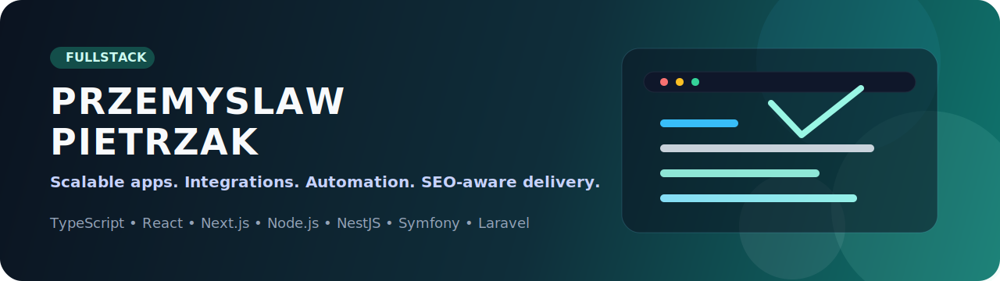

# Przemysław Pietrzak

> Fullstack Developer based in Warsaw, Poland.
> I build scalable web apps, API integrations, automation,
> and SEO-aware migrations for SMEs, NGOs, and product teams.

| [![Website][w-badge]][w-url]   | [![Email][e-badge]][e-url]       |
|:------------------------------:|:--------------------------------:|
| [![LinkedIn][l-badge]][l-url]  | [![GitHub][g-badge]][g-url]      |

## What I Build

- Product MVPs, internal platforms, and bespoke business tools.
- Integrations with REST, SOAP, webhooks, OAuth2, and public registries.
- Modernization of legacy PHP and WordPress systems into maintainable stacks.
- Delivery pipelines with tests, CI/CD, security checks,
  and infrastructure automation.

## Selected Results

- Grew a client portal's Google top-10 visibility by **5x in 6 months**.
- Migrated **1200+ articles** from Wix to WordPress with automation.
- Cut infrastructure and maintenance costs by **about 90%**
  after VPS migration and optimization.
- Raised automated testing coverage to **95%**
  in projects using Jest and Cypress.

## Featured Projects

### [PP Solutions](https://ppsolutions.com.pl/)

Custom CMS and lightweight CRM for a service business.

- Focus: lead intake, client communication, and admin dashboards.
- Outcome: one platform for website content, project intake,
  and internal operations.
- Stack: `Next.js`, `Node.js`, `Express`, `TypeScript`, `PostgreSQL`,
  `Redis`, `BullMQ`, `OAuth2`, `JWT`, `Ansible`

### LegatoDesk

Legal-tech product built around a TypeScript-first platform
and background job processing.

- Focus: modular product development for the legal industry.
- Stack: `Next.js`, `NestJS`, `TypeScript`, `Redux Toolkit`,
  `Redux Saga`, `Redis`, `BullMQ`, `REST APIs`

### ORGON

Modular HR system delivered in Symfony with containerized environments
and CI/CD.

- Focus: maintainability, deployment consistency, and performance.
- Stack: `Symfony`, `Twig`, `MySQL`, `Docker`, `Kubernetes`, `Vue`,
  `FastAPI`, `Trivy`

### [CASN](https://casn.pl/)

Full modernization from Laravel to `Next.js + TypeScript + MDX`.

- Focus: release quality, editorial workflow, and maintainability.
- Stack: `Next.js`, `React`, `TypeScript`, `MDX`, `Jest`, `Cypress`,
  `GitHub Actions`

### [Mazowieści](https://mazowiesci.pl/)

Large-scale migration from Wix to WordPress with SEO and automation.

- Focus: content migration, scripting, and organic traffic growth.
- Outcome: **5x** top-10 keyword growth in six months.
- Stack: `WordPress`, `PHP`, `Python`, `Scrapy`, `HTML`, `CSS`, `SEO`

## Core Stack

- Frontend: `TypeScript`, `React`, `Next.js`, `Vue`, `Nuxt`,
  `Tailwind CSS`
- Backend: `Node.js`, `NestJS`, `Express`, `PHP`, `Laravel`, `Symfony`
- Data and infra: `PostgreSQL`, `MySQL`, `Redis`, `Docker`,
  `Kubernetes`, `AWS`
- Quality: `Playwright`, `Cypress`, `Jest`, `PHPUnit`,
  `GitHub Actions`, `Trivy`

## Now

- Building modern products in the `TypeScript + Node.js`
  and PHP ecosystems.
- Designing integrations with REST, SOAP, webhooks, OAuth2,
  and public registries.
- Open to selected freelance, consulting, and B2B opportunities.

## Contact

- Website: [pietrzakprzemyslaw.pl](https://pietrzakprzemyslaw.pl)
- Email: [contact@pietrzakprzemyslaw.pl](mailto:contact@pietrzakprzemyslaw.pl)
- LinkedIn: [linkedin.com/in/przempietrzak](https://www.linkedin.com/in/przempietrzak/)
- Location: Warsaw, Poland

> Need a migration, integration, or product MVP?
> Reach out by email or LinkedIn.

## Polska wersja

Jestem fullstack developerem z Warszawy.
Projektuję i wdrażam aplikacje webowe end to end:
od frontendu i backendu, przez integracje API,
po infrastrukturę, SEO i automatyzację procesów.

Najmocniej pracuję dziś w stacku `TypeScript`, `React`, `Next.js`,
`Node.js`, `NestJS` oraz nowoczesne PHP, a komercyjnie realizowałem
projekty także w `Laravel`, `Symfony`, `Vue/Nuxt`, `WordPress`,
`Redis`, `PostgreSQL`, `Docker` i `Kubernetes`.

Najważniejsze efekty:

- wzrost widoczności SEO klienta **5x w 6 miesięcy**
- migracja **1200+ artykułów** z Wix do WordPressa
- obniżenie kosztów utrzymania IT o **około 90%**
- podniesienie pokrycia testami do **95%**

[w-badge]: https://img.shields.io/badge/Website-pietrzakprzemyslaw.pl-0f766e?style=for-the-badge&logo=googlechrome&logoColor=white
[w-url]: https://pietrzakprzemyslaw.pl
[e-badge]: https://img.shields.io/badge/Email-contact%40pietrzakprzemyslaw.pl-1f2937?style=for-the-badge&logo=gmail&logoColor=white
[e-url]: mailto:contact@pietrzakprzemyslaw.pl
[l-badge]: https://img.shields.io/badge/LinkedIn-Przemyslaw_Pietrzak-0a66c2?style=for-the-badge&logo=linkedin&logoColor=white
[l-url]: https://www.linkedin.com/in/przempietrzak/
[g-badge]: https://img.shields.io/badge/GitHub-przemekp95-111827?style=for-the-badge&logo=github&logoColor=white
[g-url]: https://github.com/przemekp95
