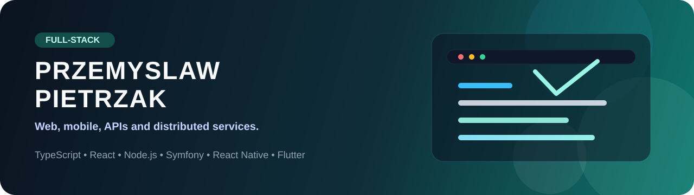

# Przemysław Pietrzak

> Full-stack TypeScript Developer based in Warsaw, Poland.
> I build and deploy web and mobile products with React/Next.js,
> Node.js/NestJS, React Native/Expo, and Flutter.
> I also develop PHP/Symfony systems, APIs, integrations, and background jobs.

<!-- markdownlint-disable MD033 -->

  

  
  &nbsp;&nbsp;
  
  &nbsp;&nbsp;
  

<!-- markdownlint-enable MD033 -->

## Selected Projects

A representative selection of my work, not a complete project list.

### [ORGON — HR system](https://product-web-production-4e4f.up.railway.app/product)

HR system developed in one monorepo with a Symfony API and worker,
a Next.js web application, Go tooling, and PostgreSQL.

- Architecture: separate command, query, and event buses; infrastructure
  ports and adapters; transactional outbox with idempotent handlers,
  retries, and dead-letter states.
- Delivery: four Railway services, automated CI gates, daily PostgreSQL
  backups, and isolated restore drills.
- Stack: `PHP 8.2+`, `Symfony 7.4`, `Doctrine`, `Messenger`, `Next.js 16`,
  `TypeScript`, `Go`, `PostgreSQL`, `Docker`, `Railway`.

### [PP Solutions — website and platform](https://ppsolutions.com.pl/)

Bilingual B2B platform for presenting services, collecting enquiries,
and supporting company processes.

- Architecture: modular monolith with capability-aligned modules,
  application use cases, ports and adapters, and repository interfaces.
- Contract: OpenAPI is the source of truth for a generated TypeScript client.
- Stack: `Next.js`, `React`, `TypeScript`, `Fastify`, `PostgreSQL`, `Redis`,
  `Render`.

### [CASN — Laravel to Next.js](https://casn.pl/)

Modernization of an editorial Laravel/Blade site into a publishing platform
built with Next.js and TypeScript.

- Architecture: the editorial CMS feeds a separate MySQL public read model;
  TypeORM repositories and explicit migrations isolate runtime reads from
  content editing.
- Code: [Next.js platform](https://github.com/przemekp95/casnnext) and
  [Laravel reference implementation](https://github.com/przemekp95/casn2).
- Stack: `Next.js 16`, `React 19`, `TypeScript`, `Laravel 11`, `PHP 8.3`,
  `Strapi 5`, `MySQL 8`, `Docker`, `Nginx`.

### [Personal portfolio](https://pietrzakprzemyslaw.pl/)

Bilingual full-stack portfolio with a Next.js frontend, NestJS backend,
and an asynchronously delivered contact form.

- Architecture: ports and adapters plus repository pattern in the contact
  and portfolio modules; outbox delivery with retry/backoff, idempotency,
  and signed provider webhooks.
- Code: [przemekp95/wizytowka](https://github.com/przemekp95/wizytowka).
- Stack: `TypeScript`, `React`, `Next.js 16`, `NestJS 11`, `MongoDB`,
  `Prisma`, `REST`, `GraphQL`, `Docker`, `Playwright`.

## Skills

- Frontend and mobile: `TypeScript`, `React`, `Next.js`, `React Native`, `Expo`,
  `Flutter`, `HTML5`, `CSS3`, `Tailwind CSS`.
- Backend and APIs: `Node.js`, `NestJS`, `Fastify`, `PHP`, `Symfony`,
  `Laravel`, `REST`, `GraphQL`, `OpenAPI`, `Webhooks`, `WebSockets/Socket.IO`,
  `Messenger`.
- Data and messaging: `PostgreSQL`, `MySQL`, `MongoDB`, `Redis`, queues,
  and background jobs.
- Architecture and patterns: microservices architecture, distributed services,
  modular monolith, Clean/Hexagonal Architecture, ports and adapters,
  DDD-style bounded contexts, CQRS, Event Sourcing, aggregates and domain
  events, projections, outbox/inbox, state machines, idempotency,
  and retry/backoff.
- Delivery: `Docker`, `GitHub Actions`, `Jenkins`, `Railway`, `Render`, `Nginx`.
- Testing: `Playwright`, `Jest`, `React Testing Library`, `PHPUnit`, `PHPStan`,
  and executable BDD scenarios.

## Current Focus

I am focused on full-stack TypeScript, React, and Node.js roles.
I also bring hands-on PHP/Symfony experience for APIs, queues,
integrations, legacy modernization, and distributed web and mobile systems.

## Contact

- Portfolio: [pietrzakprzemyslaw.pl](https://pietrzakprzemyslaw.pl)
- LinkedIn: [linkedin.com/in/przempietrzak](https://www.linkedin.com/in/przempietrzak/)
- Email: [contact@pietrzakprzemyslaw.pl](mailto:contact@pietrzakprzemyslaw.pl)
- Location: Warsaw, Poland

## Po polsku

Tworzę i wdrażam aplikacje full-stack w TypeScript: React i Next.js
po stronie frontendu oraz Node.js i NestJS po stronie backendu.
Rozwijam też systemy PHP/Symfony, API, kolejki, integracje i procesy w tle.
